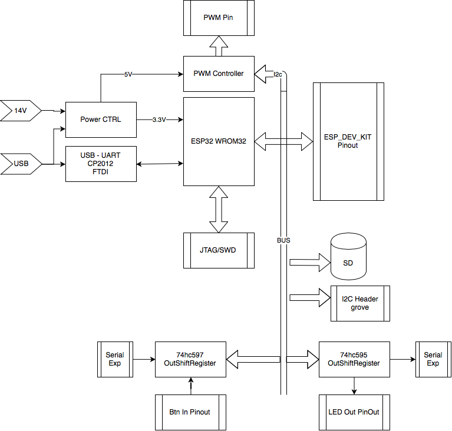

# Esp32 Lcc DevBoard   
This board is the Master Board usefull for developing new boards or firmwares.

The base Blocks / Architecture is described in figure:

This board is based on ESP32 reference designs, and inspired of Layout controlers like MegaPoints Controller or other arduino versions. 

The core is a ESP32 WROM32 (2 cores, 4MB flash, 4MB RAM) and the basic pinout but the power control adapted for 14V (DCC standard for H0). From Esp32 DevKits we add several pheripials:
* A JTAG/SWD Connector
* A SD Card Reader
* Connectors for controling the layout:
  * PWM controller like PCA9685
  * out shift register 74hc595
  * in shift register 74hc597
  * Those three with expansion conectors
* Extra conectors identifing several fuctions
  * UART 1
  * UART 2
  * Unconected ESP pins (has 38 pins, default dev kits 30)
  * ...