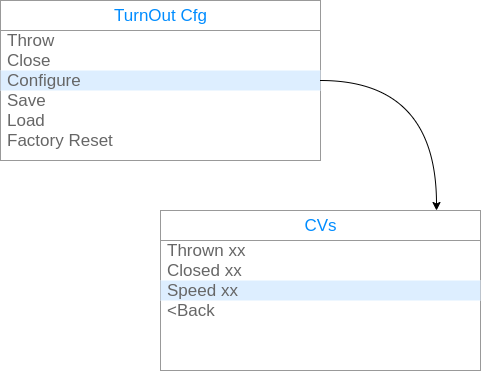

# Dcc Turnout Configure Board  
This is a litte tool to configure the Dcc Turnouts wihtout CV programing. Allowing the user to configure each Turnout controller without the complexities of CV programing on Main, or using a computer.

## Usage (intended)
To use this tool is as simple of conect the FTDI port of both boards (Tool and turnout), once powered, navigate over the menus to configure the turnout.

The navigation is:

On the main menu the options are:
* __Throw__: moves the turnout to the Thrown position
* __Close__: moves the turnout to the Closed position
* __Configure__: Reads the configuration and shows CVs
* __Save__: Save the current values to the eprom 
* __Load__: Reload the values from the eprom
* __Factory Reset__: Change the values to original ones

On the CVs screen the system will configure the values of the turnout. 
|Field|Description|Range|Increment|Fine|Recomended value|
|:--|:--|:--|:--|:--|:--|
|Thrown|Position of the servo when Thrown|0-127|10|1|65 and adjust|
|Closed|Position of the servo when Closed|0-127|10|1|115 and adjust|
|Speed|Number of steps on each cycle|0-17|4|1|4|

## Actual Work
The schematic is only for having a registry of connections

The menus are implemented to this detail, but no conection is made to other board.

## Next Steps
* [ ] Connect the boards
* [ ] Implement basic communication
* [ ] Improve protocol
* [ ] Use as a proxy (usb - tool - turnout)
* [ ] Add more parammeters (and turnout funcs)
  * [ ] Speed Cycle time
  * [ ] Servo Power off 
  * [ ] Rele control
  * [ ] status leds (signaling)
  * [ ] ...
